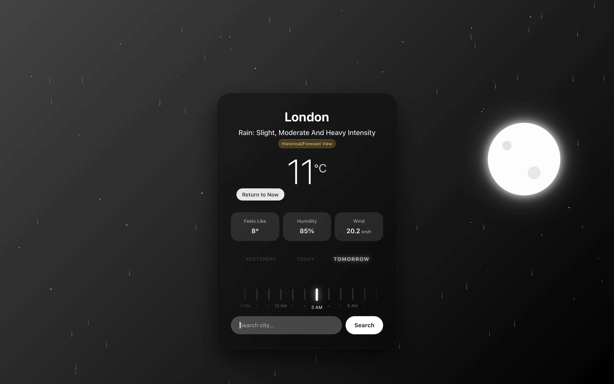

# Weather Time-Traveler: An AI-Powered Interactive Weather Experience

##  Overview
The **Weather Time-Traveler** transforms a static weather report into a dynamic, interactive journey through time. Beyond just current conditions, it provides historical and forecasted weather with a fluid, scrubber-based interface, intelligent AI briefings, and visually stunning celestial mechanics.

##  Key Features

-   **Interactive Time Scrubber:** Seamlessly scrub through 72 hours of past, present, and future weather.
    *   **Fluid UX:** Instantly updates weather data, visuals, and AI briefings as you navigate the timeline.
    *   **Contextual Day Labels:** "Yesterday", "Today", and "Tomorrow" labels highlight to orient you in time.
-   **Dynamic Celestial Orbit:** Experience a continuous, 360-degree journey of the Sun and Moon across the sky.
    *   **Physics-Based Transition:** The Sun and Moon smoothly rise and set, with seamless transitions between day and night cycles.
    *   **Golden Hour Visuals:** Timeline bars are color-coded to visually highlight sunrise, sunset, and twilight periods.
-   **AI Weather Narrator:** Get a concise, witty, one-sentence briefing summarizing the most important weather implications for your chosen location.
-   **Enhanced Weather Dashboard:** A clean, glassmorphism-inspired interface that presents key data (temperature, feels like, humidity, wind speed) at a glance.
-   **Responsive & Intuitive Design:** Optimized layout for a smooth user experience across various screen sizes.

##  Technologies Used

### Backend
-   **FastAPI**: Modern, fast (high-performance) web framework for Python.
-   **LangChain**: Orchestrates the AI agent for natural language processing and weather narration.
-   **OpenRouter**: Provides access to advanced LLMs (like `kwaipilot/kat-coder-pro:free`) for intelligent processing.
-   **Open-Meteo API**: Fetches comprehensive historical and forecast weather data.
-   **Pydantic**: Data validation and settings management.

### Frontend
-   **React**: A declarative, component-based JavaScript library for building user interfaces.
-   **Vite**: Next-generation frontend tooling for a fast development experience.
-   **Axios**: Promise-based HTTP client for making API requests.
-   **CSS3**: Advanced styling for dynamic backgrounds, glassmorphism effects, and animations.

##  Setup Instructions

### Prerequisites
-   **Node.js** (16+)
-   **Python** (3.9+)
-   **OpenRouter API Key**: Obtain one from [OpenRouter.ai](https://openrouter.ai/keys)

### 1. Backend Setup
Navigate to the `backend` directory, set up your environment, and run the server:
```bash
cd sanchai_assessment/backend
python -m venv venv
source venv/bin/activate  # On Windows: venv\Scripts\activate
pip install -r requirements.txt

# Configure environment variables
# Create a file named `api.env` in the `backend` directory
# Add your OpenRouter API Key:
# OPENROUTER_API_KEY=sk-or-v1-your-actual-key-here

uvicorn main:app --reload --port 8000
```
The backend will be available at `http://localhost:8000`.

### 2. Frontend Setup
Navigate to the `frontend` directory, install dependencies, and start the development server:
```bash
cd sanchai_assessment/frontend
npm install
npm run dev
```
The application will open at `http://localhost:5173`.

##  How It Works

1.  **User Input:** Enter a city name into the search bar.
2.  **Weather Data Fetch (Backend):** The `get_weather` tool (managed by a LangChain agent) queries Open-Meteo for 72 hours of historical and forecasted hourly weather data. It also extracts a "current snapshot" and "trend" (e.g., warmer than yesterday).
3.  **Narrative Generation (Backend):** Simultaneously, the backend's `/narrate` endpoint uses a separate LLM (`narrator_llm`) with a specialized prompt to generate a concise, witty summary of the overall weather conditions based on the current data.
4.  **Frontend Display:**
    *   The `WeatherDashboard` displays the current weather snapshot and trend.
    *   The `TimelineScrubber` visualizes the 72-hour data, allowing fluid navigation.
    *   The Sun and Moon animatedly traverse the sky, reflecting the selected time.
    *   The AI-generated weather briefing appears dynamically.

## 📸 Screenshots
### Pune Day


### Pune Night (Time Travel View)


### London


### New York


## 📂 Project Structure
```
sanchai_assessment/
├── backend/
│   ├── main.py              # FastAPI app, weather tool, and narrator agent logic
│   ├── requirements.txt     # Python dependencies
│   └── api.env              # Environment variables
├── frontend/
│   ├── src/
│   │   ├── App.jsx         # Main React component, state, and UI logic
│   │   └── App.css         # Styling for the app, animations, and glassmorphism
│   ├── package.json        # Node dependencies
│   └── vite.config.js      # Vite configuration
├── screenshots/            # Application screenshots (to be updated)
└── README.md              # Project documentation (this file)
```